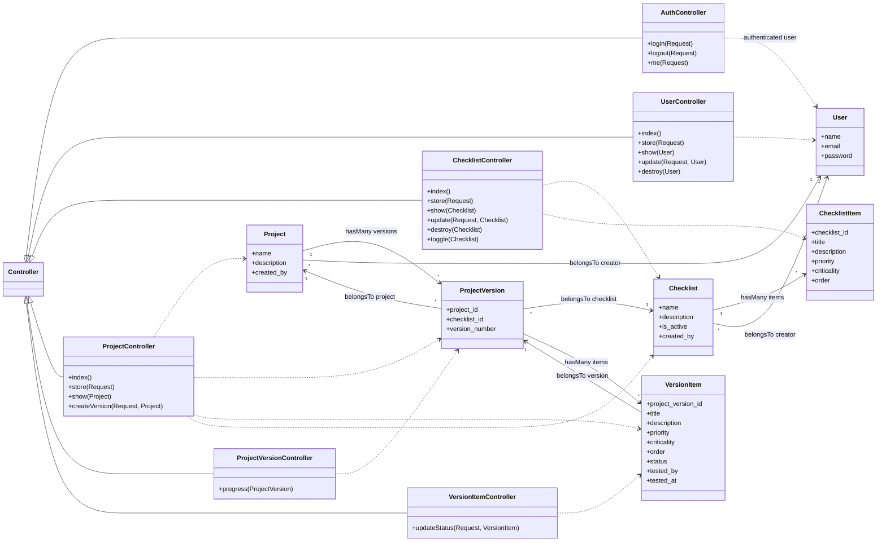
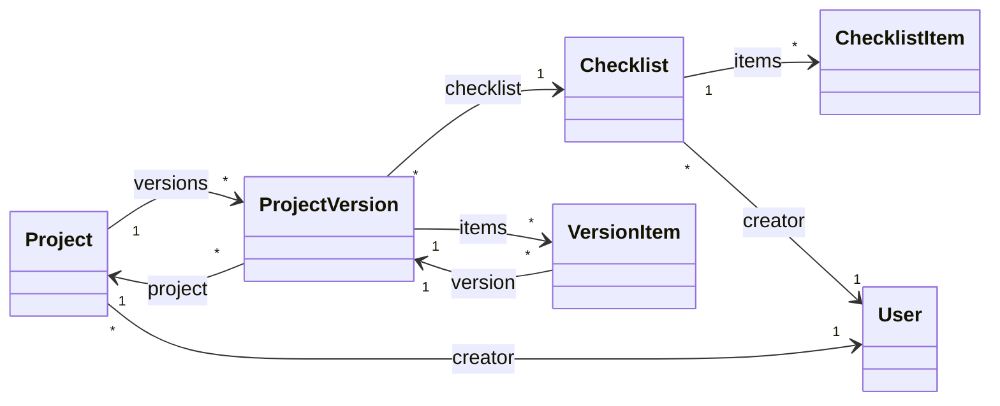

# Backend Class Diagram

This document contains Mermaid diagrams for the backend domain and API layer.

## Full Backend Class Diagram

```mermaid
classDiagram
direction LR

class Controller
class AuthController {
  +login(Request)
  +logout(Request)
  +me(Request)
}
class UserController {
  +index()
  +store(Request)
  +show(User)
  +update(Request, User)
  +destroy(User)
}
class ChecklistController {
  +index()
  +store(Request)
  +show(Checklist)
  +update(Request, Checklist)
  +destroy(Checklist)
  +toggle(Checklist)
}
class ProjectController {
  +index()
  +store(Request)
  +show(Project)
  +createVersion(Request, Project)
}
class ProjectVersionController {
  +progress(ProjectVersion)
}
class VersionItemController {
  +updateStatus(Request, VersionItem)
}

Controller <|-- AuthController
Controller <|-- UserController
Controller <|-- ChecklistController
Controller <|-- ProjectController
Controller <|-- ProjectVersionController
Controller <|-- VersionItemController

class User {
  +name
  +email
  +password
}
class Checklist {
  +name
  +description
  +is_active
  +created_by
}
class ChecklistItem {
  +checklist_id
  +title
  +description
  +priority
  +criticality
  +order
}
class Project {
  +name
  +description
  +created_by
}
class ProjectVersion {
  +project_id
  +checklist_id
  +version_number
}
class VersionItem {
  +project_version_id
  +title
  +description
  +priority
  +criticality
  +order
  +status
  +tested_by
  +tested_at
}

Checklist "1" --> "*" ChecklistItem : hasMany items
Checklist "*" --> "1" User : belongsTo creator
Project "1" --> "*" ProjectVersion : hasMany versions
Project "*" --> "1" User : belongsTo creator
ProjectVersion "*" --> "1" Project : belongsTo project
ProjectVersion "*" --> "1" Checklist : belongsTo checklist
ProjectVersion "1" --> "*" VersionItem : hasMany items
VersionItem "*" --> "1" ProjectVersion : belongsTo version

UserController ..> User
ChecklistController ..> Checklist
ChecklistController ..> ChecklistItem
ProjectController ..> Project
ProjectController ..> ProjectVersion
ProjectController ..> VersionItem
ProjectController ..> Checklist
ProjectVersionController ..> ProjectVersion
VersionItemController ..> VersionItem
AuthController ..> User : authenticated user
```

## Models-Only Diagram (ER Style)

```mermaid
classDiagram
direction LR

class User
class Checklist
class ChecklistItem
class Project
class ProjectVersion
class VersionItem

Checklist "1" --> "*" ChecklistItem : items
Checklist "*" --> "1" User : creator
Project "1" --> "*" ProjectVersion : versions
Project "*" --> "1" User : creator
ProjectVersion "*" --> "1" Project : project
ProjectVersion "*" --> "1" Checklist : checklist
ProjectVersion "1" --> "*" VersionItem : items
VersionItem "*" --> "1" ProjectVersion : version
```